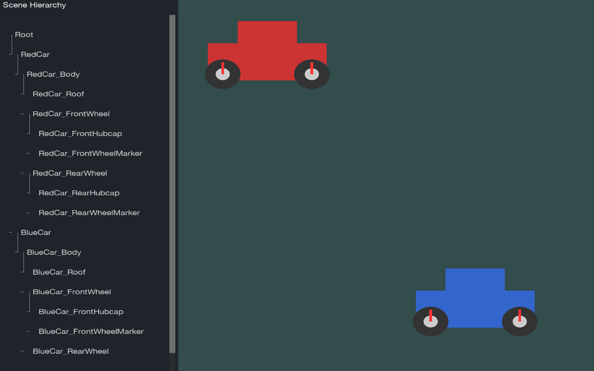

# Scene Graphs: Interactive 2D Scene Editor

This project implements a hierarchical scene graph data structure for managing 2D graphical elements. The implementation demonstrates a core tree-based architecture that supports shape manipulation within a parent-child relationship system.

## Table of Contents
- [Overview](#what-are-scene-graphs)
- [Features](#current-features--planned-features)
- [Project Structure](#project-structure)
- [Prerequisites](#prerequisites)
- [Getting Started](#getting-started)
  - [Building on Windows](#building-on-windows)
  - [Building on macOS](#building-on-macos)
  - [Building on Linux](#building-on-linux)
- [Running the Application](#running-the-application)
- [Interactive Features](#interactive-features)
- [Screenshots and Demos](#screenshots-and-demos)
- [Implementation Details](#implementation-details)
- [Key Challenges and Solutions](#key-challenges-and-solutions)
- [Testing](#testing)
- [Documentation](#documentation)
- [Development Workflow](#development-workflow)
- [Troubleshooting](#troubleshooting)
- [Implementation Components](#implementation-components)
- [References](#references)

## What Are Scene Graphs?

Scene graphs are tree-based data structures widely used in computer graphics, animation, and game development. They organize graphical elements hierarchically, making it easier to:

- Group related objects together (like wheels on a car)
- Apply transformations that cascade through related objects (move the car, wheels move too)
- Efficiently manage complex scenes with many objects

In a complete implementation, when you rotate, scale, or move a parent object, all of its children inherit those transformations - just like in professional tools like Maya, Blender, or Unity.

## Current Features & Planned Features

**Currently Implemented:**
- Core scene graph data structure with parent-child node relationships
- Basic transformation system (position, rotation, scale)
- Transformation propagation through the node hierarchy
- Framework for rendering and scene management

**Planned Features (Not Yet Implemented):**
- Interactive shape creation (rectangles and circles)
- Visual selection and transformation tools
- Grouping functionality for objects
- Complete tree view panel for hierarchy management

## Project Structure

```
SceneGraphs/
├── include/           # Header files defining classes and interfaces
│   ├── scene_graph/   # Core scene graph implementation
│   └── visualization/ # Rendering and UI components
├── src/               # Source implementations
├── test/              # Unit and integration tests
├── docs/              # Documentation
├── CMakeLists.txt     # CMake build configuration
└── Makefile           # Build automation
```

## Prerequisites

- C++ compiler with C++17 support (GCC 7+, Clang 5+, or MSVC 19.14+)
- CMake (version 3.10 or higher)
- Google Test (for running tests)
- Python 3.7+ (for documentation)

## Getting Started

### Building on Windows

1. Install prerequisites:
   - Install Visual Studio 2019 or newer with C++ development tools
   - Install CMake (https://cmake.org/download/)
   - Install Git (https://git-scm.com/download/win)

2. Clone the repository:
   ```powershell
   git clone <repository-url>
   cd SceneGraphs
   ```

3. Generate Visual Studio solution:
   ```powershell
   mkdir build
   cd build
   cmake ..
   ```

4. Build the project:
   - Open the generated solution (.sln) file in Visual Studio
   - Select Build > Build Solution
   - Or from the command line:
   ```powershell
   cmake --build . --config Release
   ```

### Building on macOS

1. Install prerequisites:
   ```bash
   # Install Homebrew if not already installed
   /bin/bash -c "$(curl -fsSL https://raw.githubusercontent.com/Homebrew/install/HEAD/install.sh)"
   
   # Install required tools
   brew install cmake
   brew install llvm
   brew install googletest
   ```

2. Clone the repository:
   ```bash
   git clone <repository-url>
   cd SceneGraphs
   ```

3. Build the project:
   ```bash
   mkdir build
   cd build
   cmake ..
   make
   ```

### Building on Linux

1. Install prerequisites:
   ```bash
   # For Debian/Ubuntu
   sudo apt update
   sudo apt install build-essential cmake libgtest-dev git python3 python3-pip
   
   # For Fedora
   sudo dnf install gcc-c++ cmake gtest-devel git python3 python3-pip
   ```

2. Clone the repository:
   ```bash
   git clone <repository-url>
   cd SceneGraphs
   ```

3. Build the project:
   ```bash
   mkdir build
   cd build
   cmake ..
   make
   ```

## Running the Application

After building, launch the application:

**Windows:**
```powershell
.\build\Release\scene_graphs_app.exe
```

**macOS/Linux:**
```bash
./build/scene_graphs_app
```

**Note:** The application is currently in development and has limited interactive functionality. The focus of this project is on the underlying scene graph data structure implementation.

## Interactive Features

### Car Example
The demo creates a scene with two cars - a red car and a blue car. Each car consists of multiple components in a hierarchical relationship:
- Car (root node)
  - Car Body (child of Car)
    - Car Roof (child of Body)
    - Front Wheel (child of Body)
      - Front Hubcap (child of Front Wheel)
    - Rear Wheel (child of Body)
      - Rear Hubcap (child of Rear Wheel)

The car example demonstrates the power of parent-child relationships in a scene graph:

1. When you drag the car, all its components (body, wheels, hubcaps) move together
2. As the car moves, the wheels automatically rotate based on the distance traveled

### Selection and Manipulation
- Click on any object to select it (highlighted in yellow)
- Drag selected objects to move them
- The tree view on the left shows the hierarchical structure
- Selecting an object in the canvas also highlights it in the tree view

## Screenshots and Demos

### Application Running with Cars and Tree View

*Main application showing two cars with hierarchical components*

### Dragging a Car & Selecting Objects
<video src="media/cars_moving.mov" width="320" height="240" controls></video>

## Implementation Details

This project demonstrates several key concepts:

- **Tree Data Structures**: Each node in our scene graph represents a graphical object with transformation properties
- **Transformation Matrices**: We use matrix operations to combine transformations through the hierarchy
- **Object-Oriented Design**: The implementation showcases inheritance, polymorphism, and encapsulation

## Key Challenges and Solutions

### Transformation Propagation
One of the major challenges was correctly implementing the propagation of transformations through the hierarchy. This was solved by carefully implementing matrix operations in the Transform class:

```cpp
Transform Node::getGlobalTransform() const {
    shared_ptr<Node> parent = parent_.lock();
    if (parent) {
        // Combine parent's global transform with our local transform
        return Transform::combine(parent->getGlobalTransform(), transform_);
    }
    return transform_;
}
```

### Hit Detection
Another challenge was implementing accurate hit detection for selecting objects, especially when they have complex transformations:

```cpp
bool Rectangle::containsPoint(const Vector2& point) const {
    Vector2 localPoint = getLocalTransform().inverseTransformPoint(point);
    float halfWidth = size_.x / 2.0F;
    float halfHeight = size_.y / 2.0F;
    return abs(localPoint.x) <= halfWidth && abs(localPoint.y) <= halfHeight;
}

bool Circle::containsPoint(const Vector2& point) const {
    Vector2 localPoint = getLocalTransform().inverseTransformPoint(point);
    float distance = length(localPoint);
    return distance <= radius_;
}
```

### Render Pipeline
Setting up the OpenGL rendering pipeline required careful management of shaders and graphics primitives:

```cpp
void ShapeRenderer::renderShape(const scene_graph::Shape& shape) {
    // Use the shape shader program
    shaderManager_->useShader(impl_->shaderName);

    // Create projection matrix
    Matrix4 projection = glm::ortho(-10.0f, 10.0f, -10.0f * impl_->viewportHeight / impl_->viewportWidth,
               10.0f * impl_->viewportHeight / impl_->viewportWidth, -1.0f, 1.0f);

    // Set projection uniform
    shaderManager_->setUniformMatrix4fv(impl_->shaderName, "projection", projection);

    // Set model matrix from the shape's transform
    shaderManager_->setUniformMatrix4fv(impl_->shaderName, "model",
                                    shape.getGlobalTransform().getMatrix());

    // Set color uniform
    shaderManager_->setUniform4f(impl_->shaderName, "color", shape.getColor());

    // Draw shape based on type
    if (const auto* rect = dynamic_cast<const scene_graph::Rectangle*>(&shape)) {
        // Render rectangle...
    } else if (const auto* circle = dynamic_cast<const scene_graph::Circle*>(&shape)) {
        // Render circle...
    }
}
```

## Implementation Components

### Project Goal
This project implements an interactive 2D scene editor that demonstrates scene graph data structures in action. The application creates basic shapes, organizes them hierarchically, and allows the user to move objects while observing how parent-child relationships affect transformations between objects.

### Scene Graph Implementation
The core of this project is a tree-based data structure where each node represents a graphical object with properties for transformation (position, rotation, scale), visual attributes (shape type, color), and relationships (parent and children).

Trees are ideal for this application because they:
- Clearly represent containment and hierarchical relationships
- Allow simple propagation of transformations from parents to children
- Enable recursive operations like rendering and hit testing
- Provide O(log n) access time for finding objects
- Support intuitive organization of graphical elements

### Node Class
The foundation of the scene graph is the Node class, which manages the parent-child relationships:
```cpp
class Node : public std::enable_shared_from_this<Node> {
public:
    Node(std::string name);
    virtual ~Node();

    const std::string& getName() const { return name_; }
    void setName(const std::string& name) { name_ = name; }

    // Hierarchy operations
    std::weak_ptr<Node> getParent() const { return parent_; }
    const std::vector<std::shared_ptr<Node>>& getChildren() const { return children_; }
    void addChild(const std::shared_ptr<Node>& child);
    void removeChild(const std::shared_ptr<Node>& child);

    // Transform operations
    const Transform& getLocalTransform() const { return transform_; }
    Transform& getLocalTransform() { return transform_; }
    void setLocalTransform(const Transform& transform) { transform_ = transform; }
    Transform getGlobalTransform() const;

    // Convenience methods
    void setPosition(const Vector2& position);
    Vector2 getPosition() const;
    void setRotation(float rotation);
    float getRotation() const;
    void setScale(const Vector2& scale);
    Vector2 getScale() const;

    bool hasParent(const std::shared_ptr<Node>& potentialParent) const;
    bool isOrphaned() const;

private:
    std::string name_;
    std::weak_ptr<Node> parent_;
    std::vector<std::shared_ptr<Node>> children_;
    Transform transform_;  // Local transform only
};
```

### Transform Class
The Transform class handles the mathematical operations for positioning, rotating, and scaling objects:
```cpp
class Transform {
public:
    Transform();
    Transform(const Transform& original);
    Transform& operator=(const Transform& original);
    ~Transform() = default;

    // Matrix operations
    const Matrix4& getMatrix() const { return matrix_; }
    void setMatrix(const Matrix4& matrix);

    // Property getters/setters
    void setScale(const Vector2& scale);
    void setPosition(const Vector2& position);
    void setRotation(float rotation);
    
    const Vector2& getScale() const { return scale_; }
    float getRotation() const;
    const Vector2& getPosition() const { return position_; }

    Transform inverse() const;
    Vector2 transformPoint(const Vector2& point) const;
    Vector2 inverseTransformPoint(const Vector2& point) const;

    // Static utility methods
    static Transform combine(const Transform& parent, const Transform& child);
    static Transform interpolate(const Transform& start, const Transform& end, float factor);
    static Vector2 localToGlobalCoordinates(const Transform& parent, const Transform& child, const Vector2& point);
    static Vector2 globalToLocalCoordinates(const Transform& parent, const Transform& child, const Vector2& point);

private:
    void updateMatrix();
    Vector2 position_;
    float rotation_;
    Vector2 scale_;
    Matrix4 matrix_;
};
```

### Shape Classes
The Shape class extends Node to add visual properties, and specific shapes like Rectangle and Circle inherit from it:

```cpp
class Shape : public Node {
public:
    Shape(std::string name);
    virtual ~Shape() = default;

    // Color methods
    void setColor(const Vector4& color);
    const Vector4& getColor() const;

    // Pure virtual methods to be implemented by derived classes
    virtual void render() const = 0;
    virtual bool containsPoint(const Vector2& point) const = 0;

private:
    Vector4 color_ = Vector4(1.0F, 1.0F, 1.0F, 1.0F);  // Default white
};

class Rectangle : public Shape {
public:
    Rectangle(const std::string& name, const Vector2& size = DEFAULT_SIZE);
    
    // Size methods
    void setSize(const Vector2& size);
    const Vector2& getSize() const;

    // Implementation of Shape virtual methods
    void render() const override;
    bool containsPoint(const Vector2& point) const override;

private:
    Vector2 size_;
    static constexpr Vector2 DEFAULT_SIZE = Vector2(1.0F);
};

class Circle : public Shape {
public:
    Circle(const std::string& name, float radius = DEFAULT_RADIUS);
    
    // Radius methods
    void setRadius(float radius);
    float getRadius() const;

    // Implementation of Shape virtual methods
    void render() const override;
    bool containsPoint(const Vector2& point) const override;

private:
    float radius_;
    static constexpr float DEFAULT_RADIUS = 0.5F;
};
```

### Visualization Components

#### Canvas
The Canvas manages rendering the scene graph and handling user interactions:
```cpp
class Canvas {
public:
    Canvas();
    ~Canvas();

    // Initialize the canvas with a renderer
    bool initialize(const std::shared_ptr<Renderer>& renderer);

    // Set the root node of the canvas
    void setRoot(const std::shared_ptr<scene_graph::Node>& root);
    std::shared_ptr<scene_graph::Node> getRoot() const;

    // Add/remove shapes
    void addShape(const std::shared_ptr<scene_graph::Shape>& shape);
    void removeShape(const std::shared_ptr<scene_graph::Shape>& shape);

    // Canvas methods
    void render();
    void clear();
    void renderNode(const std::shared_ptr<scene_graph::Node>& node);
    std::shared_ptr<scene_graph::Node> hitTest(const Vector2& position) const;
    void selectNode(const std::shared_ptr<scene_graph::Node>& node);
    std::shared_ptr<scene_graph::Node> getSelectedNode() const;

private:
    std::shared_ptr<Renderer> renderer_;
    std::shared_ptr<scene_graph::Node> root_;
    std::shared_ptr<scene_graph::Node> selectedNode_;
    std::vector<std::shared_ptr<scene_graph::Shape>> shapes_;
};
```

#### Renderer
The Renderer class handles the OpenGL rendering pipeline:
```cpp
class Renderer {
public:
    Renderer();
    ~Renderer();

    // Initialization and cleanup
    bool initialize();
    void cleanup();

    // Frame management
    void beginFrame();
    void endFrame();
    void setViewport(int width, int height);

    // Shape rendering
    void renderShape(const scene_graph::Shape& shape);
    void drawRectangle(float x, float y, float width, float height, const Vector4& color);
    void drawLine(float x1, float y1, float x2, float y2, const Vector4& color, float thickness = 0.02f);

    // Text rendering
    void drawText(const std::string& text, float x, float y, const Vector4& color);

private:
    // Mode
    RenderMode mode_ = RenderMode::Normal;

    // Component managers and renderers
    std::shared_ptr<ShaderManager> shaderManager_;
    std::shared_ptr<FontManager> fontManager_;
    std::shared_ptr<TextRenderer> textRenderer_;
    std::shared_ptr<ShapeRenderer> shapeRenderer_;

    // Viewport dimensions
    int viewportWidth_ = constants::DEFAULT_WINDOW_WIDTH;
    int viewportHeight_ = constants::DEFAULT_WINDOW_HEIGHT;
};
```

## Testing

To run the test suite:

**Windows:**
```powershell
cd build
ctest -C Release
```

**macOS/Linux:**
```bash
cd build
ctest
```

Tests verify the correctness of:
- Node relationships and hierarchical operations
- Transformation calculations and propagation
- Core data structure functionality

## Documentation

### Setting Up Documentation Environment

1. Create and activate a Python virtual environment:

**Windows:**
```powershell
python -m venv venv
.\venv\Scripts\Activate.ps1
```

**macOS/Linux:**
```bash
python3 -m venv venv
source venv/bin/activate
```

2. Install required packages:
```bash
pip install -r requirements.txt
```

3. Serve the documentation locally:
```bash
mkdocs serve
```

The documentation will be available at `http://127.0.0.1:8000`

### Building Documentation

To build the documentation for deployment:
```bash
mkdocs build
```

This will create a `site` directory containing the static documentation files.

## Development Workflow

1. Make changes to the code
2. Run tests to ensure functionality
3. Update documentation if necessary
4. Build and run the application to verify changes

## Troubleshooting

- **Build Fails**: Ensure you have the required compiler and CMake versions
- **Missing Dependencies**: Check that all prerequisites are installed correctly
- **Runtime Errors**: The application logs errors to stderr; check for these messages
- **Compiler Errors**: If using older compilers, check that C++17 features are supported

## References

- Sedgewick, R., & Wayne, K. (2011). Algorithms (4th ed.). Addison-Wesley Professional.
- Real-Time Rendering (4th Edition) by Akenine-Möller, Haines, and Hoffman
- OpenGL documentation
